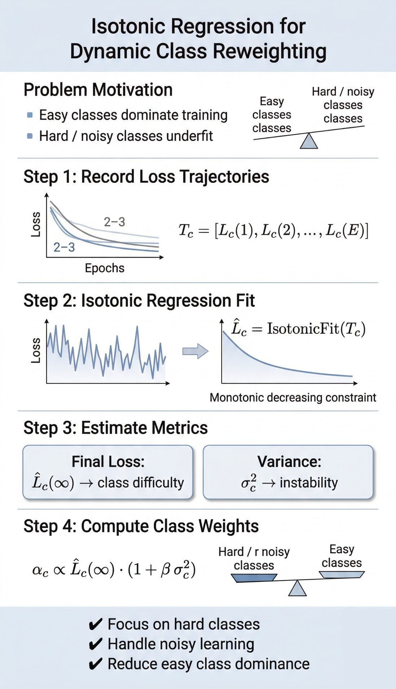

[](https://opensource.org/licenses/MIT)
[](https://www.python.org/downloads/)

---

# 🏙️ Urban Issue Classifier — Severity-Guided Multi-Task NLP Model

## 📌 Overview

This project implements a **severity-aware multi-task text classification system** for urban issue detection using **RoBERTa**.

The model jointly predicts:

* 🏷️ **Category** (8 urban issue classes)
* ⚠️ **Severity** (Low, Medium, High)

It incorporates **advanced training strategies** such as:

* Class-balanced focal loss with **dynamic reweighting**
* **Prototype-guided attention**
* **Contrastive learning**
* Severity-aware training


---

## 🧠 Problem Statement

Urban complaints (e.g., social media posts) often contain:

* Multiple signals (category + urgency)
* Noise, slang, and emotional language

Traditional classifiers:

* Ignore severity
* Treat all samples equally
* Fail on imbalanced data

👉 This project addresses these issues using **multi-task learning + severity-aware modeling**.

---

## 🏗️ Model Architecture

### Backbone

* `roberta-base` (HuggingFace Transformers)

### Heads

#### 1. Category Head (Cosine Similarity)

* Projects embeddings into label space
* Uses **learned category embeddings**
* Scaled cosine similarity (CLIP-style)

#### 2. Severity Head

* MLP classifier:

```
768 → 768 → 3
```

#### 3. Prototype-Based Attention

* Learns a **global severity prototype vector**
* Computes per-sample attention:

```
W_i = sigmoid((E_i · P_s) / τ)
```

---

## ⚙️ Key Innovations

### 🔹 1. Dynamic Class Reweighting (Isotonic Regression)

* Tracks loss trajectory per class
* Estimates **learning difficulty**
* Adjusts class weights:

```
α_c ∝ asymptotic_loss × (1 + β·variance)
```

---

### 🔹 2. Severity-Aware Loss Scaling

Higher severity samples contribute more:

```
L_cat *= (1 + α * severity)
```

---

### 🔹 3. Prototype Learning

* Initializes from severity centroids
* Encourages separation:

```
L_proto = max(0, margin - ||P_high - P_low||)
```

---

### 🔹 4. Supervised Contrastive Learning

* Pulls same-category samples together
* Pushes different categories apart

---

### 🔹 5. Label Smoothing

* Prevents overconfidence
* Improves generalization

---

## 📊 Dataset

* ~37,000 posts

* 8 categories:

  * Environmental Health
  * Housing & Rent
  * Waste & Sanitation
  * Transit Systems
  * Healthcare Access
  * Road Integrity
  * Public Safety
  * Utility Stability

* Severity:

  * Low
  * Medium
  * High

### Split

* Train: 70%
* Validation: 15%
* Test: 15%
* Stratified on **category × severity**

---

## 🧪 Training Pipeline

### Stage 1 — Warm-up

* Train only category head
* Class-balanced focal loss
* Backbone frozen initially

---

### Stage 2 — Reweighting

* Fit isotonic regression
* Compute dynamic class weights

---

### Stage 3 — Initialization

* Compute severity centroids
* Initialize:

  * Prototype vector
  * Category embeddings

---

### Stage 4 — Main Training

Full loss:

```
L_total =
  λ_cbf * L_CBF +
  λ_sev * L_severity +
  λ_proto * L_prototype +
  λ_contrast * L_contrast
```

---

## 📈 Evaluation Metrics

### Category

* Macro F1
* Weighted F1
* Accuracy

### Severity

* MAE (ordinal-aware)
* Accuracy

### Joint

* Combined accuracy (both correct)

---

## 📊 Outputs

* Training curves
* Confusion matrices
* Attention analysis
* JSON results summary

---

## 🚀 How to Run

### 1. Install Dependencies

```bash
pip install transformers datasets torch torchmetrics scikit-learn pandas numpy matplotlib seaborn tqdm coral-pytorch
```

---

### 2. Prepare Dataset

CSV format:

```csv
Post,Category,Severity
"text...",Housing & Rent,High
```

---

### 3. Update Path

In code:

```python
DATA_PATH = "path/to/your/dataset.csv"
```

---

### 4. Run Pipeline

Execute all cells (Jupyter / script):

```bash
python train.py
```

---

## 🔍 Example Predictions

| Text                    | Category           | Severity          |
| ----------------------- | ------------------ | ----------------- |
| Garbage not collected   | Waste & Sanitation | Low               |
| Cracked roof collapsing | Housing & Rent     | ⚠️ Should be High |
| Transit delays          | Transit Systems    | Medium            |

---

## ⚠️ Limitations

* Severity predictions can **collapse to majority class**
* Attention weights may **not strongly separate severity**
* Synthetic data may introduce bias
* Not optimized for real-world deployment

---


---

# 🏙️ Urban Issue Classifier — Severity-Guided Multi-Task NLP Model

## 📌 Overview

This project implements a **severity-aware multi-task text classification system** for urban issue detection using **RoBERTa**.

The model jointly predicts:

* 🏷️ **Category** (8 urban issue classes)
* ⚠️ **Severity** (Low, Medium, High)

It incorporates **advanced training strategies** such as:

* Class-balanced focal loss with **dynamic reweighting**
* **Prototype-guided attention**
* **Contrastive learning**
* Severity-aware training

> ⚠️ Note: This project is intended for **portfolio and engineering demonstration**, not for publication.

---

## 🧠 Problem Statement

Urban complaints (e.g., social media posts) often contain:

* Multiple signals (category + urgency)
* Noise, slang, and emotional language

Traditional classifiers:

* Ignore severity
* Treat all samples equally
* Fail on imbalanced data

👉 This project addresses these issues using **multi-task learning + severity-aware modeling**.

---

## 🏗️ Model Architecture

### Backbone

* `roberta-base` (HuggingFace Transformers)

### Heads

#### 1. Category Head (Cosine Similarity)

* Projects embeddings into label space
* Uses **learned category embeddings**
* Scaled cosine similarity (CLIP-style)

#### 2. Severity Head

* MLP classifier:

```
768 → 768 → 3
```

#### 3. Prototype-Based Attention

* Learns a **global severity prototype vector**
* Computes per-sample attention:

```
W_i = sigmoid((E_i · P_s) / τ)
```

---

## ⚙️ Key Innovations

### 🔹 1. Dynamic Class Reweighting (Isotonic Regression)

* Tracks loss trajectory per class
* Estimates **learning difficulty**
* Adjusts class weights:

```
α_c ∝ asymptotic_loss × (1 + β·variance)
```

---

### 🔹 2. Severity-Aware Loss Scaling

Higher severity samples contribute more:

```
L_cat *= (1 + α * severity)
```

---

### 🔹 3. Prototype Learning

* Initializes from severity centroids
* Encourages separation:

```
L_proto = max(0, margin - ||P_high - P_low||)
```

---

### 🔹 4. Supervised Contrastive Learning

* Pulls same-category samples together
* Pushes different categories apart

---

### 🔹 5. Label Smoothing

* Prevents overconfidence
* Improves generalization

---

## 📊 Dataset

* ~37,000 posts

* 8 categories:

  * Environmental Health
  * Housing & Rent
  * Waste & Sanitation
  * Transit Systems
  * Healthcare Access
  * Road Integrity
  * Public Safety
  * Utility Stability

* Severity:

  * Low
  * Medium
  * High

### Split

* Train: 70%
* Validation: 15%
* Test: 15%
* Stratified on **category × severity**

---

## 🧪 Training Pipeline

### Stage 1 — Warm-up

* Train only category head
* Class-balanced focal loss
* Backbone frozen initially

---

### Stage 2 — Reweighting

* Fit isotonic regression
* Compute dynamic class weights

---

### Stage 3 — Initialization

* Compute severity centroids
* Initialize:

  * Prototype vector
  * Category embeddings

---

### Stage 4 — Main Training

Full loss:

```
L_total =
  λ_cbf * L_CBF +
  λ_sev * L_severity +
  λ_proto * L_prototype +
  λ_contrast * L_contrast
```

---

## 📈 Evaluation Metrics

### Category

* Macro F1
* Weighted F1
* Accuracy

### Severity

* MAE (ordinal-aware)
* Accuracy

### Joint

* Combined accuracy (both correct)

---

## 📊 Outputs

* Training curves
* Confusion matrices
* Attention analysis
* JSON results summary

---

## 🚀 How to Run

### 1. Install Dependencies

```bash
pip install transformers datasets torch torchmetrics scikit-learn pandas numpy matplotlib seaborn tqdm coral-pytorch
```

---

### 2. Prepare Dataset

CSV format:

```csv
Post,Category,Severity
"text...",Housing & Rent,High
```

---

### 3. Update Path

In code:

```python
DATA_PATH = "path/to/your/dataset.csv"
```

---

### 4. Run Pipeline

Execute all cells (Jupyter):

---

## 🔍 Example Predictions

| Text                    | Category           | Severity          |
| ----------------------- | ------------------ | ----------------- |
| Garbage not collected   | Waste & Sanitation | Low               |
| Cracked roof collapsing | Housing & Rent     | ⚠️ Should be High |
| Transit delays          | Transit Systems    | Medium            |

---

## ⚠️ Limitations

* Severity predictions can **collapse to majority class**
* Attention weights may **not strongly separate severity**
* Synthetic data may introduce bias
* Not optimized for real-world deployment

---
